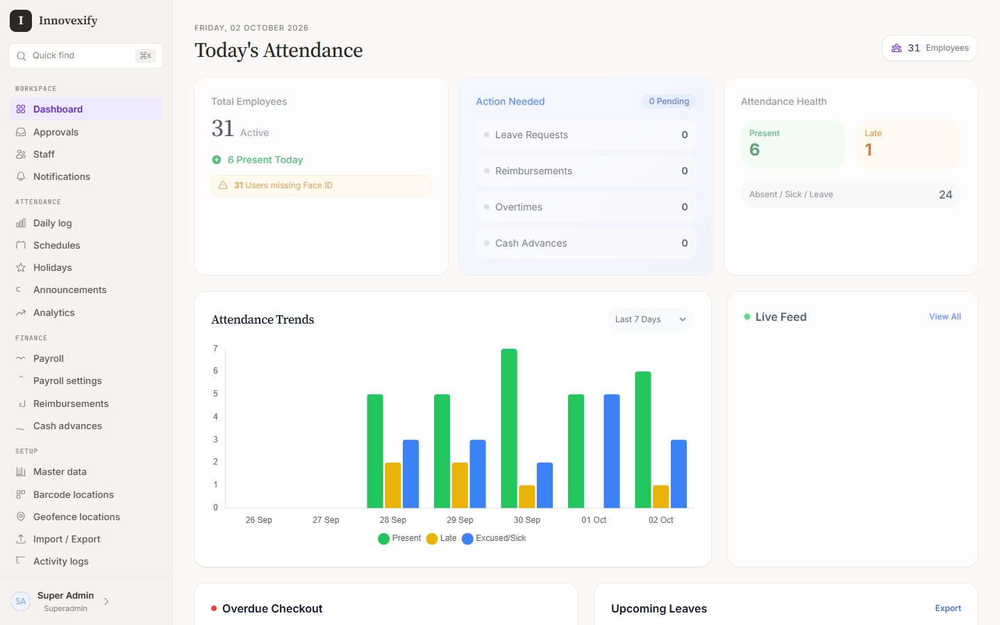
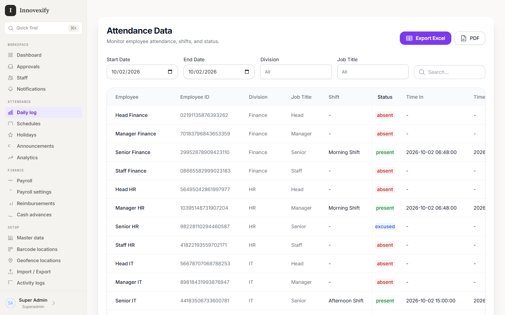
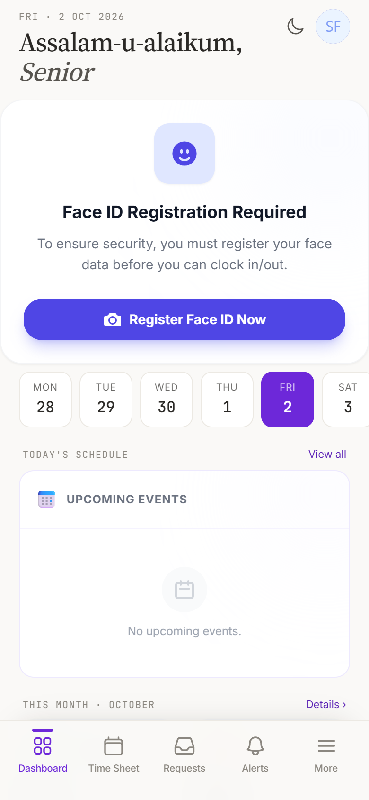
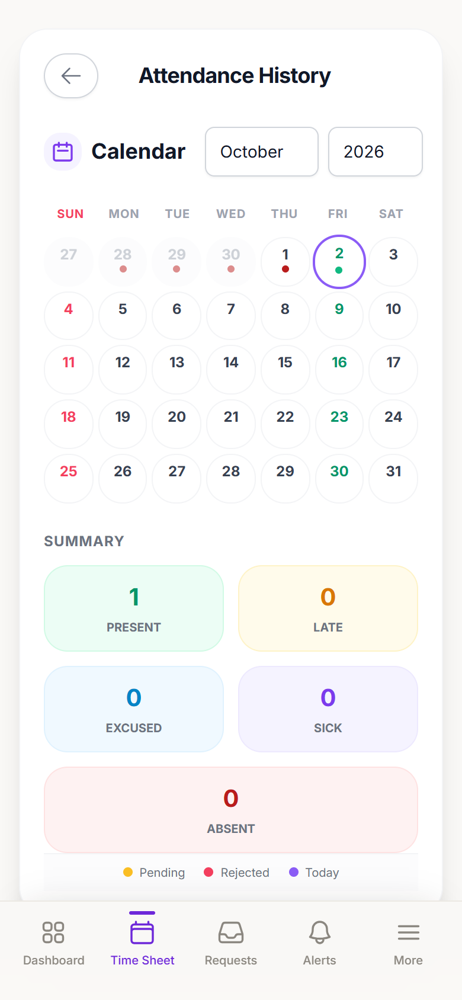
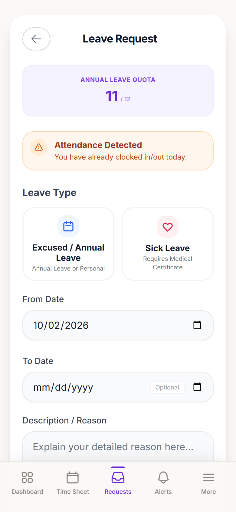

# innovexify

```
$ innovexify --about
attendance + HR for teams that aren't all sitting in one office.
check in from your phone. prove you were actually there. get paid right.
```

I built this because "just mark yourself present on the sheet" stops working the moment a team spreads across sites, shifts and cities. Innovexify runs as a web app for admins and a phone app (Android + PWA) for everyone else, off one Laravel codebase.

It's set up for Pakistan out of the box: CNIC on employee records, province-level regions, local holidays, English everywhere.

## screenshots





<p>
  
  
  
</p>

## what it does

```
check-in    gps geofence per location, face match, qr scan, selfie as proof
anti-spoof  flags mock-location apps and suspicious gps accuracy
shifts      rotas, schedules, late / early / absent tracking
requests    leave, overtime, reimbursements, cash advances
approvals   two-step: division head, then finance
payroll     allowances, deductions, advance auto-deduction, pdf payslips
reports     attendance export to excel, analytics dashboard, employee map
admin       multiple geofence locations, roles, app settings, announcements
```

## how it's put together

- **Laravel 11 + Livewire 3.** Server-rendered, reactive where it matters, no separate API to babysit.
- **Tailwind**, with a soft Notion-ish design system. Sidebar on desktop, bottom tab bar on mobile, a `⌘K` command palette for jumping anywhere.
- **Capacitor** wraps the same app for Android, so the phone gets native camera and GPS.
- **MySQL** for data, **Leaflet + OpenStreetMap** for maps (free tiles, no API key).
- **Railway** for hosting. The `Procfile` migrates and boots on every deploy.

```
phone (capacitor / pwa) ──┐
                          ├──> laravel + livewire ──> mysql
admin (browser) ──────────┘          │
                                     └──> storage (private photo access)
```

## run it locally

You need PHP 8.3, Composer, Node and MySQL.

```bash
git clone https://github.com/itsahmeds/innovexify-app.git
cd innovexify-app
cp .env.example .env
composer install
npm install
```

Create a database, put its details in `.env` (and set `SEED_ADMIN_PASSWORD` so the seeder can create your admin accounts), then:

```bash
php artisan key:generate
php artisan migrate --seed
php artisan storage:link
```

Then run `npm run dev` and `php artisan serve` in two terminals.

GPS and camera only work over HTTPS (or localhost). If you're testing on a real phone, put it behind a tunnel.

## ship it

Railway picks up the `Procfile`. Set `APP_ENV=production`, `APP_DEBUG=false`, your DB vars and `APP_URL`, push, done.

Updating a server by hand instead:

```bash
bash update.sh
```

## android build

```bash
npm run build
npx cap sync android
cd android && ./gradlew assembleRelease
```

The APK lands in `android/app/build/outputs/apk/release/`. Signing reads `ANDROID_KEYSTORE`, `ANDROID_KEYSTORE_PASSWORD`, `ANDROID_KEY_ALIAS` and `ANDROID_KEY_PASSWORD` from your environment, so bring your own keystore.

## license

MIT. See [LICENSE](./LICENSE).
